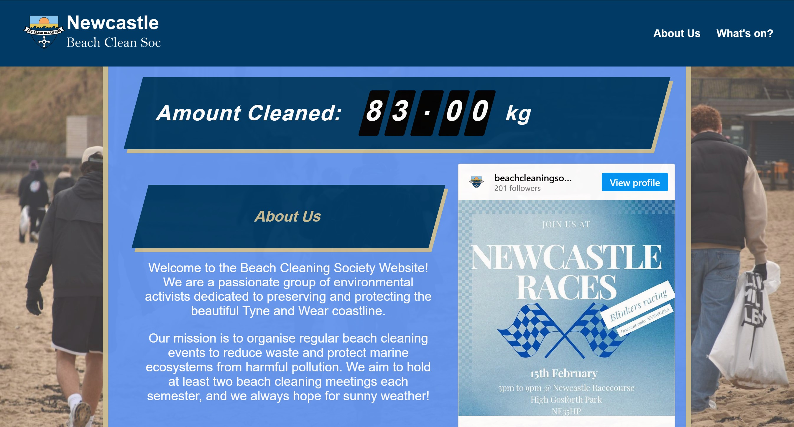

# 🌊 Beach Cleaning Society Website

[](https://react.dev/)
[](https://aws.amazon.com/amplify/)
[](https://opensource.org/licenses/MIT)

[www.nubeachcleansoc.org](https://www.nubeachcleansoc.org)

**Official website for the Newcastle University Beach Cleaning Society**  
A React-based platform promoting beach cleaning initiatives and community engagement.



## 🚀 Features

- **Interactive Homepage** with real-time rubbish counter
- **Events Calendar** with upcoming cleanups and socials
- **Instagram Integration** for latest updates
- **Responsive Design** for all devices
- **AWS Amplify Hosting** with automatic HTTPS

## 🛠️ Tech Stack

- **Frontend**: React 19 + React Router
- **Styling**: Styled Components
- **Social Media**: `react-social-media-embed`
- **Hosting**: AWS Amplify
- **CI/CD**: GitHub Actions

## 📦 Installation

1. **Clone Repository**
   ```bash
   git clone https://github.com/your-username/beach-cleaning-society.git
   cd beach-cleaning-society
   ```
   
2. **Install Dependencies**
   ```bash
   npm install
   ```
   
3. **Run Development Server**
   ```bash
   npm start
   ```
   
## 🎨 Design System

**Colour Palette:**

- Primary Blue: ```#003a65```
- Accent Gold: ```#CBBD93```
- White: ```#ffffff```

**Font:** Roboto (Google fonts)

## 🤝 Contributing

1. **Fork the project**
2. **Create your own feature branch**
   ```bash
   git checkout -b feature/AmazingFeature
   ```
3. **Commit changes**
   ```bash
   git commit -m 'Add some AmazingFeature'
   ```
4. **Push to branch**
   ```bash
   git push origin feature/AmazingFeature
   ```
5. **Open a pull request**

## 📄 License

Distributed under the MIT License. See [LICENSE](LICENSE.md) for more information.

## 📬 Contact

- **Society Email:** [beachcleaningsociety@outlook.com](mailto:beachcleaningsociety@outlook.com)
- **My Email:** [otj2003@live.com](mailto:otj2003@live.com)
- **Instagram:** [@beachcleaningsociety__ncl](https://www.instagram.com/beachcleaningsociety__ncl)

---

### 🌱 Protect Our Coasts - One Cleanup at a Time!

*Proudly maintaining Tyne & Wear's coastline since 2024*